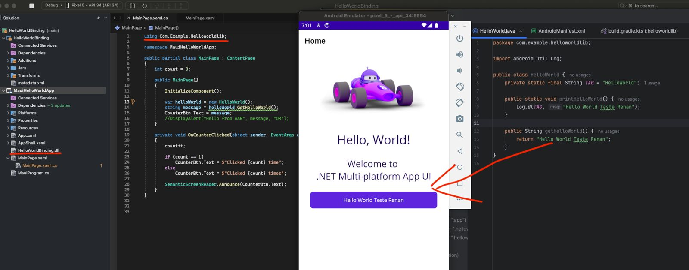

# Android library ".aar" to .NET MAUI App

||
| ---------- |

### POC de Exemplo de consumo de um .aar para um App .NET MAUI
<li> Faz o binding .aar para Android Library e gerar .dll </li>
<li> Importa .dll para ser consumido em um App .NET MAUI </li>
